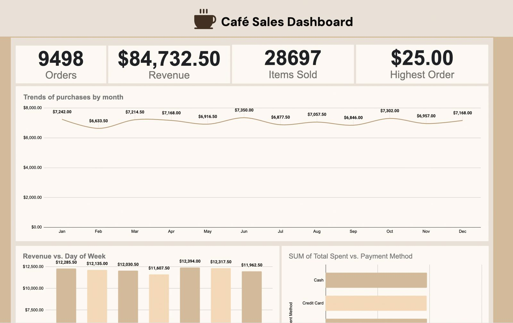

# Café Sales Performance Dataset

## Project Overview
This dataset contains detailed transactional sales records for a café operating under a quick-service model from **January 2023 through December 2023**. It supports sales performance analysis, KPI development, and operational decision-making.

## File Details
- **Total Records:** 9,498 transactions
- **Primary Key:** `Transaction ID`
- **Time Period:** Jan 2023 – Dec 2023
- **Granularity:** One row per transaction

## Data Dictionary

| Column Name        | Description                                              | Data Type   |
|--------------------|----------------------------------------------------------|------------|
| **Transaction ID** | Unique identifier for each sale                         | String     |
| **Item**           | Product category (Coffee, Salad, Sandwich, etc.)        | Categorical|
| **Payment Method** | Mode of payment (Cash, Credit Card, Digital Wallet)     | Categorical|
| **Location**       | Service channel (In-store, Takeaway, Not Specified)     | Categorical|
| **Transaction Date** | Date of purchase (YYYY-MM-DD)                        | Date       |
| **Quantity**       | Number of items purchased                               | Numeric (Integer)    |
| **Price Per Unit** | Unit price in USD                                       | Numeric (Float)      |
| **Total Spent**    | Total transaction value (USD)                           | Numeric (Float)      |

## Key Insights & Statistics
- **Total Revenue:** $84,732.50  
- **Total Items Sold:** 28,697  
- **Average Order Value:** ~$8.92  
- **Top Revenue Drivers:** Salad, Sandwich, Smoothie  
- **Balanced Channels:** In-store and Takeaway revenue nearly equal  

## Dashboard Overview 

## Analysis Suggestions
1. **Revenue Trends:** Identify monthly demand stability.
2. **Product Contribution:** Analyze revenue share by item.
3. **Payment Behavior:** Compare transaction counts across payment types.
4. **Channel Performance:** Evaluate in-store vs takeaway sales.

## Data Cleaning Notes
- Missing categories standardized to “Not Specified”.
- Verified revenue calculations (Quantity × Price).
- Dates formatted for monthly and weekday analysis.

---
*Prepared for Café Sales Dashboard & KPI Analysis.*
